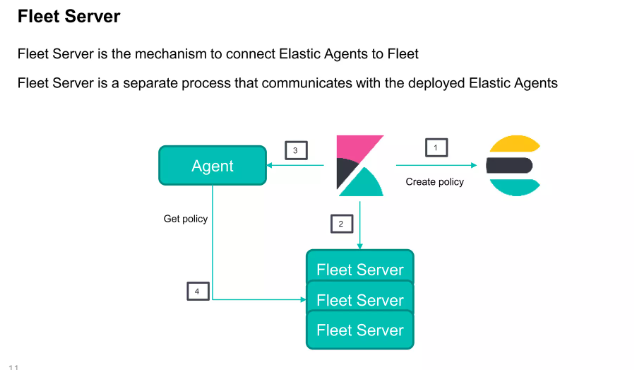

# Linux hardening

1. Disable root login over SSH:

              sudo apt update && sudo apt upgrade -y 
              sudo yum update -y  # RHEL-based


2. Set Up a Firewall (iptables/UFW):
              
              sudo ufw allow 5601/tcp  # Kibana
              sudo ufw allow 9200/tcp  # Elasticsearch
              sudo ufw allow 5044/tcp  # Logstash (Beats)
              sudo ufw enable

3. For iptables:
             
             sudo iptables -A INPUT -p tcp --dport 5601 -s <your-ip> -j ACCEPT
             sudo iptables -A INPUT -p tcp --dport 9200 -s <your-ip> -j ACCEPT
             sudo iptables -A INPUT -p tcp --dport 5044 -s <your-ip> -j ACCEPT

# Elasticsearch Security Hardening
             
1. Enable Authentication & TLS:
            
   1.1. elasticsearch.ym:
             
              xpack.security.enabled: true

   1.2. Enable SSL/TLS to encrypt traffic:
              
              xpack.security.http.ssl.enabled: true
              xpack.security.http.ssl.key: /path/to/key.pem
              xpack.security.http.ssl.certificate: /path/to/cert.pem

    1.3. Limit API Access:
        
      1.3.1 Restrict API access using firewall rules or security groups.
      
      1.3.2 Disable dangerous features:
            
             script.allowed_types: none

    1.4 Kibana Security Hardening:
    
    1.5 Run Logstash as a non-root user:
             
            sudo usermod -aG logstash elkuser

# File & Process Security

             chmod -R 700 /etc/elasticsearch
             chmod -R 700 /etc/kibana
             chmod -R 700 /etc/logstash

# <span style='color: red;'>Docker  Installation</span>

## commands
             
             sudo apt-get update
             sudo apt-get install ca-certificates curl
             sudo install -m 0755 -d /etc/apt/keyrings
             sudo curl -fsSL https://download.docker.com/linux/ubuntu/gpg -o /etc/apt/keyrings/docker.asc
             sudo chmod a+r /etc/apt/keyrings/docker.asc
             
             echo \"deb [arch=$(dpkg --print-architecture) signed-by=/etc/apt/keyrings/docker.asc] https://download.docker.com/linux/ubuntu \$(. /etc/os-release && echo "${UBUNTU_CODENAME:-$VERSION_CODENAME}") stable" | \
             
             sudo tee /etc/apt/sources.list.d/docker.list > /dev/null
             
             sudo apt-get update

# ELK stack (Collect and visulize logs)

### What's inside ELK Stack ?
1. ElasticSearch Nodes (Cluster of 3 or more nodes )
2. LogStash (For collectiing logs and pass them too Elasticsearch)
3. Kibana (For visulizing Logs and data about them)
4. Elastic Agent + Fleet server(For pusing logs from sourses to Logstash)


### How to deploy & Installation ?
there are several ways to deplpy but we are going to use docker compose with below services 


1. elasic nodes (Master Worker, Worker)
2. Logstash (Single Node)
2. fleet server (Installed on the rsyslog server or elasticsearch server)
3. LogStash (Single Node)
4. Kibana (Single Node)
5. Elastic Agent 


### Configuration

1. Docker compose of nodes 
````
services:
  setup:
    profiles:
      - setup
    build:
      context: setup/
      args:
        ELASTIC_VERSION: ${ELASTIC_VERSION}
    init: true
    volumes:
      - ./setup/entrypoint.sh:/entrypoint.sh:ro,Z
      - ./setup/lib.sh:/lib.sh:ro,Z
      - ./setup/roles:/roles:ro,Z
    environment:
      ELASTIC_PASSWORD: ${ELASTIC_PASSWORD:-}
      LOGSTASH_INTERNAL_PASSWORD: ${LOGSTASH_INTERNAL_PASSWORD:-}
      KIBANA_SYSTEM_PASSWORD: ${KIBANA_SYSTEM_PASSWORD:-}
      METRICBEAT_INTERNAL_PASSWORD: ${METRICBEAT_INTERNAL_PASSWORD:-}
      FILEBEAT_INTERNAL_PASSWORD: ${FILEBEAT_INTERNAL_PASSWORD:-}
      HEARTBEAT_INTERNAL_PASSWORD: ${HEARTBEAT_INTERNAL_PASSWORD:-}
      MONITORING_INTERNAL_PASSWORD: ${MONITORING_INTERNAL_PASSWORD:-}
      BEATS_SYSTEM_PASSWORD: ${BEATS_SYSTEM_PASSWORD:-}
    networks:
      - elk
    depends_on:
      - elasticsearch

  elasticsearch:
    build:
      context: elasticsearch/
      args:
        ELASTIC_VERSION: ${ELASTIC_VERSION}
    volumes:
      - ./elasticsearch/config/elasticsearch.yml:/usr/share/elasticsearch/config/elasticsearch.yml:ro,Z
      - elasticsearch:/usr/share/elasticsearch/data:Z
    ports:
      - 9200:9200
      - 9300:9300
    environment:
      node.name: elasticsearch
      ES_JAVA_OPTS: -Xms512m -Xmx512m
      # Bootstrap password.
      # Used to initialize the keystore during the initial startup of
      # Elasticsearch. Ignored on subsequent runs.
      ELASTIC_PASSWORD: ${ELASTIC_PASSWORD:-}
      # Use single node discovery in order to disable production mode and avoid bootstrap checks.
      # see: https://www.elastic.co/guide/en/elasticsearch/reference/current/bootstrap-checks.html
      discovery.type: single-node
    networks:
      - elk
    restart: unless-stopped

  logstash:
    build:
      context: logstash/
      args:
        ELASTIC_VERSION: ${ELASTIC_VERSION}
    volumes:
      - ./logstash/config/logstash.yml:/usr/share/logstash/config/logstash.yml:ro,Z
      - ./logstash/pipeline:/usr/share/logstash/pipeline:ro,Z
    ports:
      - 5044:5044
      - 50000:50000/tcp
      - 50000:50000/udp
      - 9600:9600
    environment:
      LS_JAVA_OPTS: -Xms256m -Xmx256m
      LOGSTASH_INTERNAL_PASSWORD: ${LOGSTASH_INTERNAL_PASSWORD:-}
    networks:
      - elk
    depends_on:
      - elasticsearch
    restart: unless-stopped

  kibana:
    build:
      context: kibana/
      args:
        ELASTIC_VERSION: ${ELASTIC_VERSION}
    volumes:
      - ./kibana/config/kibana.yml:/usr/share/kibana/config/kibana.yml:ro,Z
    ports:
      - 5601:5601
    environment:
      KIBANA_SYSTEM_PASSWORD: ${KIBANA_SYSTEM_PASSWORD:-}
    networks:
      - elk
    depends_on:
      - elasticsearch
    restart: unless-stopped

networks:
  elk:
    driver: bridge

volumes:
  elasticsearch:

````

###  <span style='color: red;'>Log Streams</span> 
1. waf
      - a : scrap logs from syslog by elastic agent
      - b : filebeat
      - c : push
2. security
       
3. applications
      - a : scrap logs from syslog by elastic agent
      - b : filebeat
      - c : push


### Elk Schema 

  


1. Data Collection & Formatting (Agent Layer)
2. Processing with Logstash
3. Storing & Indexing with Elasticsearch
4. Visualization with Kibana


# Conclusion
                   
                   The ELK Stack is a robust solution for log management and analysis. 
                   By collecting, processing, storing, and visualizing data, it helps 
                   organizations gain valuable insights, improve system performance, 
                   and enhance security.